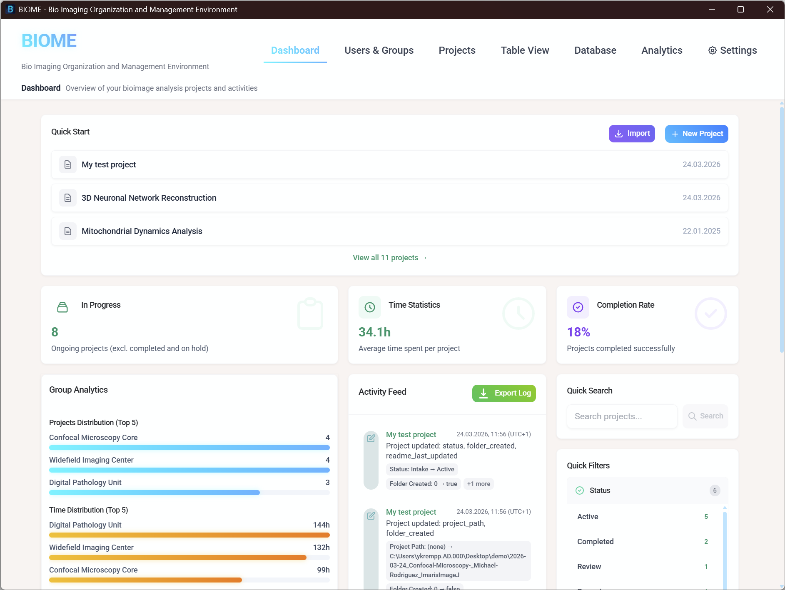
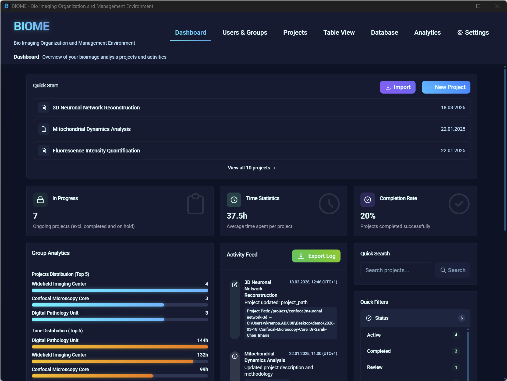
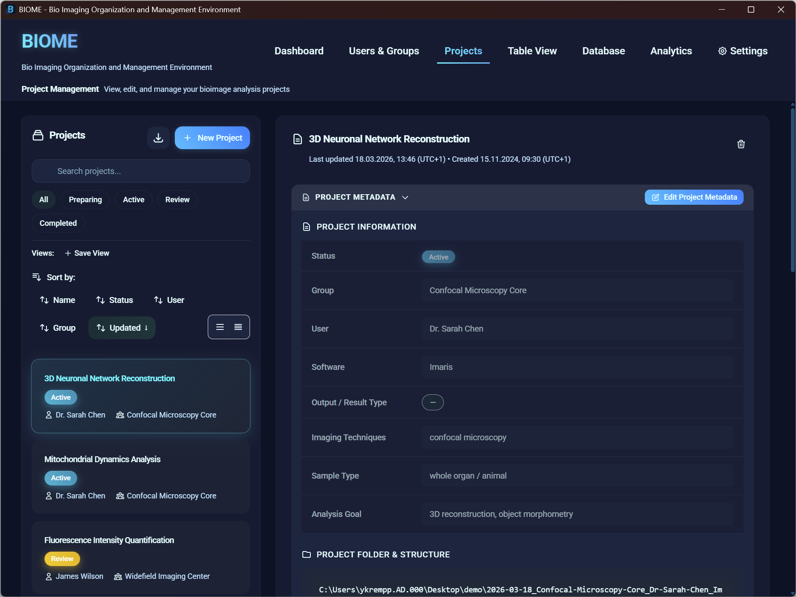
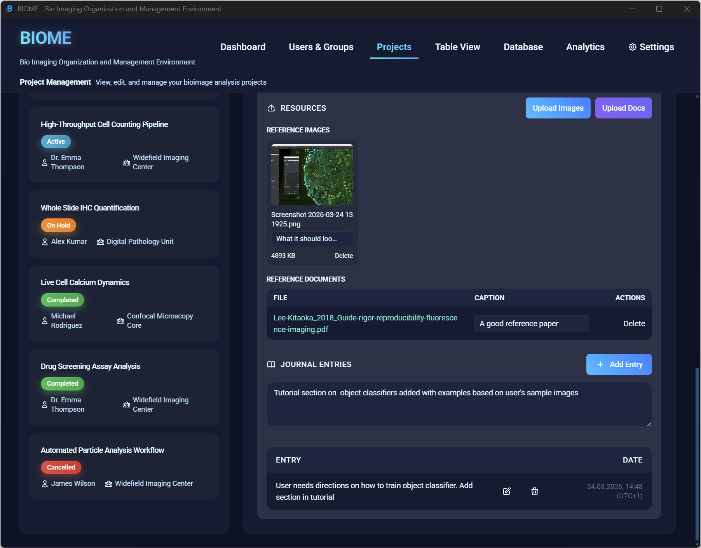
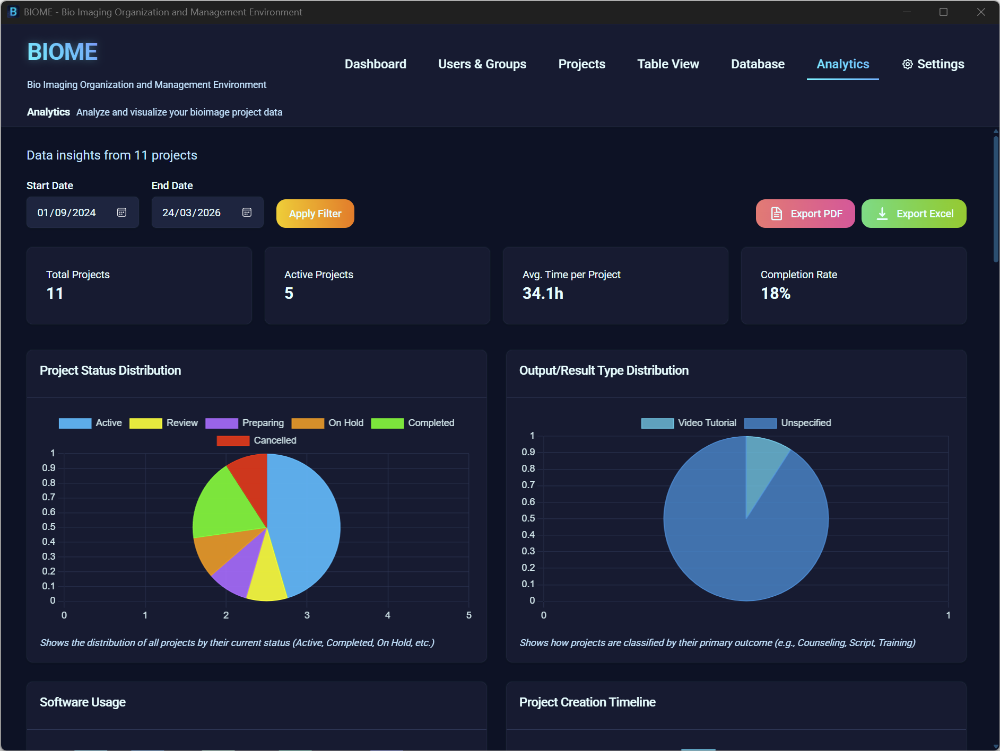
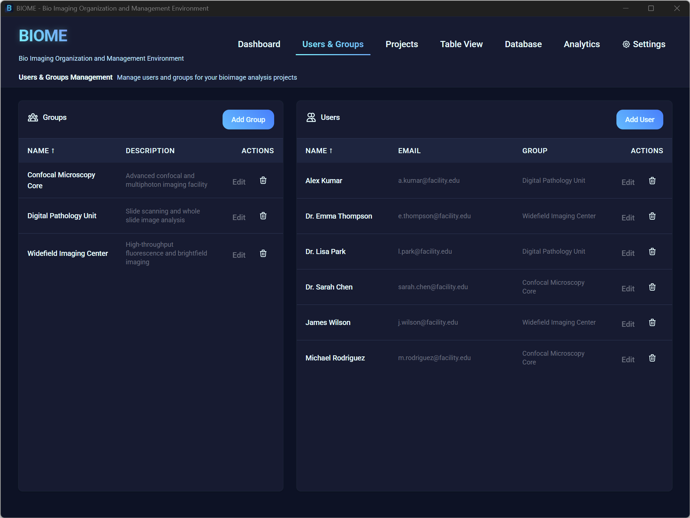

# BIOME - Bio Imaging Organization and Management Environment

<div align="center">

**A comprehensive bioimage analysis project management tool for research facilities and laboratories**

[](https://creativecommons.org/licenses/by-nc/4.0/)
[](#download)
[](#installation)

[🚀 Quick Start](#quick-start) • [📦 Download](#download) • [�️ Development](#development-setup) • [📚 Documentation](#documentation) • [🤝 Contributing](#contributing)

</div>

---

## 🔬 Overview

BIOME is a specialized project management application designed for **bioimage analysis facilities** and **research laboratories**. It helps organize, track, and manage biological imaging projects from inception to completion, supporting workflows with popular tools like **Imaris**, **FIJI/ImageJ**, **QuPath**, and **CellProfiler**.

### ✨ Key Features

- 🗄️ **Hybrid Storage**: SQLite for metadata + project folders for files — portable, lightweight, and organized
- 🏢 **Multi-Facility Support**: Organize projects across imaging cores (Confocal, Widefield, Digital Pathology)
- 👥 **Team Management**: Track projects by facility staff and research groups
- 📊 **Project Tracking**: Monitor analysis progress, time investment, and project status
- 📓 **Digital Lab Journal**: Document methodology, results, and analysis notes
- 📎 **Project Resources**: Attach images/documents to projects; auto-inject a Resources section into the project README
- ⚙️ **Dynamic Metadata**: Software, imaging techniques, sample types, and analysis goals are fully configurable from Settings — no config files required
- 📈 **Progress Analytics**: Visualize project timelines, workload distribution, and productivity
- 💻 **Dual Mode**: Available as both a native desktop app and a web application

### 🎯 Perfect for

- **Core Facility Managers**: Track projects across multiple imaging modalities
- **Bioimage Analysis Staff**: Organize complex analysis pipelines and document workflows
- **Research Students**: Manage thesis projects and maintain analysis records
- **Lab Groups**: Coordinate shared imaging resources and collaborative projects

---

## 🚀 Quick Start

### Desktop Application (Recommended)

1. **Download** the latest MSI installer: [BIOME_2.4.0_x64_en-US.msi](https://github.com/UniversalBuilder/BIOME/releases/download/v2.4.0/BIOME_2.4.0_x64_en-US.msi)
2. **Install** by double-clicking the MSI file (administrator rights required)
3. **Launch** BIOME from your Start Menu
4. **Explore**: BIOME starts with an empty database — click **Load Demo Data** on the Database page to populate it with realistic sample projects

### Web Application (Development)

```powershell
git clone <repository-url>
cd BIOME
.\setup-dependencies.bat

cd projet-analyse-image-frontend
npm run start-both
# Open http://localhost:3000
```

---

## 📦 Download

| Type | Location |
|------|----------|
| MSI Installer | [Latest Release](https://github.com/UniversalBuilder/BIOME/releases/latest) |
| Source Code | `git clone https://github.com/UniversalBuilder/BIOME.git` |

**Verify integrity (optional):**
```powershell
Get-FileHash .\BIOME_2.4.0_x64_en-US.msi -Algorithm SHA256
```
Compare against the `.sha256` file published alongside the MSI on the Releases page.

If Windows SmartScreen warns, select "More info" → "Run anyway" (unsigned development build).

---

## 📦 Installation

### System Requirements

- **OS**: Windows 10 (1809+) or Windows 11, 64-bit
- **Memory**: 4 GB RAM minimum, 8 GB recommended
- **Storage**: 500 MB free disk space

### Desktop Installation Steps

1. Right-click the MSI file → "Run as administrator"
2. Follow the installation wizard (accept license, choose directory, etc.)
3. After installation, launch BIOME from the Start Menu
4. First startup may take 30–60 seconds while the backend initializes
5. Go to **Database → Load Demo Data** to explore the app with realistic content

| Light mode | Dark mode |
|---|---|
|  |  |

---

## ✨ What's New

### v2.4.0 (2026-03-03)

**Dynamic Metadata Options**
Software, Imaging Techniques, Sample Types, and Analysis Goals are now stored in the database and fully manageable from **Settings → Metadata Management** — no config file edits required.

- All four metadata fields seeded with sensible defaults on first launch
- Dropdowns in Project Details and the New Project Wizard populate live from the database
- Options sorted **A → Z** automatically everywhere

**Settings — Metadata Management Card**
- Tabs for each metadata category (Software, Imaging Techniques, Sample Types, Analysis Goals)
- Add, edit inline, and delete options directly from the UI
- Deletion is blocked if the option is in use by one or more projects
- Compact **chip layout** for options — no wasted vertical space
- Settings page is now correctly scrollable within the app's fixed-height layout

**Bug Fixes**
- Fixed a backend startup error caused by malformed SQL strings in project routes
- Fixed 404 errors on `/api/metadata-options` endpoints

### v2.3.0
- Initial infrastructure for metadata configuration management

### v2.2.0
- **Demo Data Mode**: one-click population of the database with realistic projects from three imaging facilities; empty database on fresh install — demo content is entirely opt-in
- Bug fixes: backup date display, delete project modal (React Portal), all confirmation modals upgraded to WizardFormModal with danger variant
- UI: cleaner project creation wizard; unified accent color on + New Group / + New User buttons

### v2.1.0
- Automatic backup scheduler (configurable daily/weekly snapshots triggered on app start)
- Backup UI in the Database page (Create, List, Restore)
- ProjectDetails: visual zone separation; read-only sections dimmed in view mode
- Bug fixes: missing project fields on creation; replaced all `window.confirm()` dialogs with WizardFormModal for Tauri compatibility

### v2.0.0
- **Hybrid storage architecture**: SQLite for metadata + project folders for files
- Full UI/UX overhaul: unified scrollbars, modernized About card, Settings data management card
- Activity Feed with pagination; Table View and Analytics use page-level scrolling

---

## 🧪 Demo Data

BIOME ships with an empty database. Go to **Database → Load Demo Data** to populate it instantly. A timestamped backup is created automatically if the database already contains data.

| Facility | Sample Projects |
|---|---|
| Confocal Microscopy Core | 3D neuronal network reconstruction, live cell calcium dynamics, mitochondrial tracking |
| Widefield Imaging Center | High-throughput cell counting, fluorescence quantification, drug screening |
| Digital Pathology Unit | Tissue classification (QuPath), whole-slide IHC quantification, tumor microenvironment mapping |

Each project includes realistic timelines, analysis notes, software workflows, and progress tracking. To remove demo data, use **Database → Reset**.

---

## 🖼️ Screenshots









---

## 🛠️ Development Setup

### Prerequisites
- Node.js 16.0.0+
- npm (included with Node.js)
- Windows 10/11
- PowerShell 5.1+

### Setup

```powershell
git clone <repository-url>
cd BIOME
.\setup-dependencies.bat      # or .\setup-dependencies.ps1
```

### Running

```powershell
# Web development (frontend :3000 + backend :3001)
cd projet-analyse-image-frontend
npm run start-both

# Desktop development (Tauri + hot reload)
cd projet-analyse-image-frontend
npm run tauri-dev
```

### Building for Production

```powershell
cd projet-analyse-image-frontend

# MSI installer (dependencies must already be set up)
npm run simple-msi

# Full build including dependency setup
npm run build-with-deps
```

Output: `projet-analyse-image-frontend/src-tauri/target/release/bundle/msi/`

Use `;` to chain PowerShell commands (not `&&`).

---

## 📁 Project Structure

```
BIOME/
├── backend/                        # Node.js/Express backend (dev)
│   ├── src/
│   │   ├── server.js
│   │   ├── database/               # Schema, migrations, demo data
│   │   ├── models/
│   │   └── routes/                 # API routes
│   └── data/                       # SQLite database (dev)
├── projet-analyse-image-frontend/  # React 18 + Tailwind frontend
│   ├── src/
│   │   ├── components/
│   │   ├── pages/
│   │   ├── services/               # API services (auto-route web vs desktop)
│   │   └── utils/environmentDetection.js
│   └── src-tauri/                  # Tauri v2 desktop wrapper
│       ├── src/main.rs
│       ├── tauri.conf.json
│       └── resources/backend/      # Bundled Node backend for MSI
├── BIOME-Distribution/             # MSI checksums and release notes
├── docs/                           # Technical documentation
├── screenshots/
└── setup-dependencies.bat/.ps1
```

### Key Design Patterns

**Environment detection** — always use:
```js
import Environment from '../utils/environmentDetection';
const isDesktop = Environment.isTauri();
```

**Dual-mode I/O** — `src/services/filesystemApi.js` and `src/services/tauriApi.js` automatically route to the correct backend (Rust/Tauri on desktop, Express on web).

**UI conventions** — use `WizardFormModal` for all create/edit/delete confirmations.

---

## 🚨 Troubleshooting

### "Failed to fetch" / API Errors
- Press **Ctrl+Shift+D** in the desktop app to open the debug console
- Check backend server status, Node.js path, and API connectivity
- Backend logs: `%LOCALAPPDATA%\BIOME\logs\` (desktop) or `backend/logs/` (web dev)

### Windows SmartScreen Warning
Click "More info" → "Run anyway". This appears because the build is not signed with a commercial certificate.

### Build Failures

```powershell
# Clean rebuild
cd projet-analyse-image-frontend
npm run clean-build

# Or fully clean dependencies first
cd ..
.\setup-dependencies.ps1 -Clean
cd projet-analyse-image-frontend
npm run simple-msi
```

### Database Location
- **Desktop**: `%LOCALAPPDATA%\BIOME\data\database.sqlite`
- **Web dev**: `backend/data/database.sqlite`

---

## 📚 Documentation

| Document | Description |
|---|---|
| [INSTALL_INSTRUCTIONS.txt](./BIOME-Distribution/INSTALL_INSTRUCTIONS.txt) | End-user installation guide |
| [BIOME_Technical_Document.md](./docs/BIOME_Technical_Document.md) | Architecture and technical reference |
| [DEPENDENCY_MANAGEMENT.md](./DEPENDENCY_MANAGEMENT.md) | Dependency strategy and commands |
| [SOLO_RELEASE_CHECKLIST.md](./SOLO_RELEASE_CHECKLIST.md) | End-to-end versioning and publishing workflow |
| [CHANGELOG.md](./CHANGELOG.md) | Full version history |

In-app help is available at **Settings → Help & Documentation**.

---

## 🤝 Contributing

Contributions from the bioimage analysis community are welcome.

- 🐛 **Report bugs**: open a GitHub issue with reproduction steps
- 💡 **Suggest features**: open a GitHub issue describing the workflow need
- 🔧 **Submit code**: fork the repo, develop on a feature branch, open a pull request

See [SOLO_RELEASE_CHECKLIST.md](./SOLO_RELEASE_CHECKLIST.md) for the release workflow.

---

## 📄 License

**BIOME** is licensed under the [Creative Commons Attribution-NonCommercial 4.0 International License](https://creativecommons.org/licenses/by-nc/4.0/).

- ✅ Free for academic institutions and research facilities
- ✅ Modify and adapt for research needs
- ✅ Share with attribution
- ❌ Commercial use prohibited without permission

---

<div align="center">

**Built with ❤️ for the bioimage analysis community**

[⬆ Back to top](#biome---bio-imaging-organization-and-management-environment)

</div>